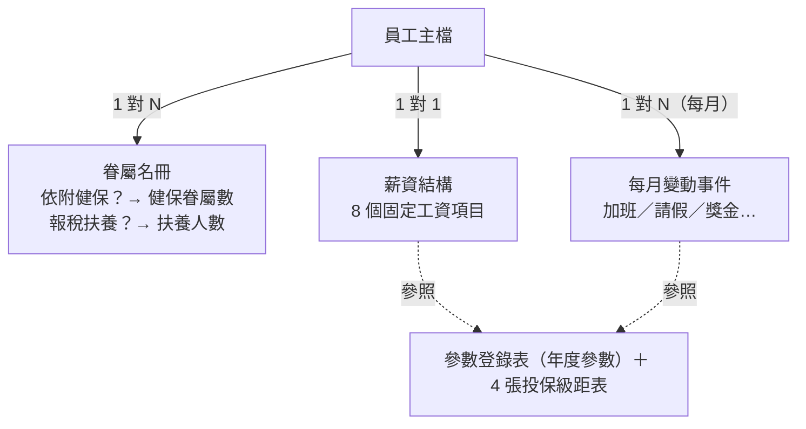

# 台灣合規薪資計算系統 — 設計文件（115 年）

> 定義台灣月薪制薪資計算的完整法規模型：資料模型、計算公式、法定參數與法源出處。據此可用任何技術——試算表、資料庫＋服務、HRIS 模組——實作出合規的薪資工具。

適用：月薪制受僱者｜參數年度：民國 115 年（2026）｜文件編製日 2026/06/11

> 🔗 **線上 Demo（開箱即用）**：<https://kielchang.github.io/taiwan-hr-salary/>
> 純前端、資料僅存於你自己的瀏覽器（localStorage），不上傳任何伺服器；內建 62 人示範公司可直接試用——每月結算與查核、報表與薪資條、薪酬分析、專案成本、加退保/停復保名冊、員工生命週期與固定津貼。

## 檔案結構說明

```
taiwan-hr-salary/
├── README.md                      ← 本文件：法規模型與設計規格
├── docs/
│   ├── appendix/
│   │   ├── 附錄A_Excel公式對照.md  ← 設計公式 ⇄ 儲存格公式逐條對照（查核、除錯用）
│   │   ├── 附錄B_Excel設計說明.md  ← Excel 設計理念、架構、技術與維護指引
│   │   └── 附錄C_網站實作架構.md   ← React + shadcn 實作的架構規劃、頁面對照與驗收
│   ├── compliance/                ← 個資/資安合規：系統定位（合規00）、差距分析主報告（合規01）、
│   │                                 六法域附表（合規02～07）、分階段路線圖（合規08）
│   └── sources/                   ← 法定參數查證依據：來源01～05（清單見 §11）
├── excel/
│   └── 薪資計算系統_115年版.xlsx   ← 參考實作（16 張工作表）；HR／一般使用者由此開始，操作與維護見附錄B
├── src/                           ← React + shadcn 網站實作（§5 純函數、§4 設定檔；架構見附錄C）
└── tests/                         ← §9 驗收測試基準集（acceptance.test.ts）
```

**後續網站系統開發之檔案分置原則**：

| 位置 | 內容 | 原則 |
|---|---|---|
| `docs/` | 設計、法規、對照文件 | 僅放文件，不放程式碼 |
| `excel/` | Excel 參考實作 | 凍結為對照基準，開發期間不修改 |
| `src/` | 網站程式碼（React + shadcn） | 計算模組依 §5 純函數實作；法定數值外置為設定檔（§4），不寫死於程式。架構見[附錄C](docs/appendix/附錄C_網站實作架構.md) |
| `tests/` | 自動化測試 | 以 §9 驗收案例為基準測試集（TC-1～TC-9）；§8 不變量納入驗證層（`src/lib/validation.ts`） |

> **網站延伸功能（核心薪資管線之外、只讀薪資不影響結算）**：除依本規格的薪資結算（含薪資條加密 PDF／mailto 通知／批次 ZIP）外，網站另含
> **薪酬分析**（成本結構、分布與公平之 CV/Gini/Lorenz、compa-ratio 與薪資級距＋**市場行情對標**、獎金·分紅試算、年度/季度調薪試算＋**分配方法並排比較**、**專案別人事成本依工時/百分比分攤（全載成本＋未分攤/間接桶、FTE/稼動率、預算 vs 實際；出勤工時自動帶入、跨月 EAC/燃燒率＋EVM、專案×部門矩陣、標準工率 charge-out 差異）**、**薪酬趨勢儀表板（歷期快照）與年度預算追蹤**，零相依 SVG 圖表＋CSV／PDF 月報；每分頁最上方並依數據自動產生**白話「重點意見」**——直接給結論與建議，數據僅作佐證）
> 、**出勤打卡**（GPS 軟性圍欄＋選用 IP、彈性上下班每日彙整）
> 與**法規申報與資料治理**（年度扣繳憑單彙總、勞健退繳費清單、2/8 月投保級距申報調整、加退保/停保/復保作業清單；整檔 JSON 備份/還原、員工 CSV 批次匯入、員工生命週期（在職/離職/留停/停職/暫離/復職，逐日破月＋各狀態給薪比例、到/離職當月勞保費按在職天數）、自訂固定津貼與新進員工預設帶入、調薪試算核定寫回薪資、變更稽核軌跡）。均為純前端、資料存瀏覽器 localStorage，並以 react-router-dom（HashRouter）控制路由、GitHub Actions 部署至 GitHub Pages。詳見[附錄C](docs/appendix/附錄C_網站實作架構.md)。

## 目錄

**模型設計** — 工程師重新實作由此開始，§1–§6 依序即實作藍圖

1. [問題定義與設計範圍](#1-問題定義與設計範圍)
2. [設計原則](#2-設計原則)（P1–P8）
3. [資料模型](#3-資料模型)（即資料表結構）
4. [參數登錄表（115 年值與法源）](#4-參數登錄表115-年值與法源)（即設定檔，數值不寫死於程式）
5. [計算模型](#5-計算模型)（即純函數模組）
6. [捨入策略（設計決策）](#6-捨入策略設計決策)

**驗證與驗收** — 任何實作完成後，據此確認正確性：輸入相同應得到相同輸出

7. [控制點與例外設計](#7-控制點與例外設計)
8. [合規檢核（不變量與驗證規則）](#8-合規檢核不變量與驗證規則)（即驗證層）
9. [驗收測試](#9-驗收測試)（即基準測試集）

**共通參考** — 維護者與使用前檢核由此開始：比對現行公告判斷參數時效，更新時只改參數、不碰公式（P1/P2）

10. [參數法規依據對照表](#10-參數法規依據對照表)
11. [來源資料文件](#11-來源資料文件)

---

## 1. 問題定義與設計範圍

薪資計算的本質是一條**法定轉換管線**：

```
固定薪資設定 ＋ 當月變動事件  ──法定規則──►  應發 / 代扣 / 實發 / 雇主成本 / 申報基礎
```

**輸入**：員工主資料、薪資結構（固定工資項目）、眷屬名冊、每月變動事件（加班時數、請假時數、獎金、其他加減項）。
**輸出**：員工端（應發明細、六類代扣、實發）、雇主端（四險負擔、總成本）、申報端（扣繳稅額、補充保費、分類成本）。
**合規邊界**：勞動基準法、勞工保險條例、就業保險法、勞工職業災害保險及保護法、全民健康保險法（含二代補充保費）、勞工退休金條例、所得稅法暨各類所得扣繳率標準。
**非目標**：排班與出勤資料蒐集、時薪制、申報媒體檔產出、離職結算（資遣費／未休特休折算另案）。

---

## 2. 設計原則

任何技術實作都應守住以下八條，這也是本設計與「拿計算機慢慢按」的根本差異：

**P1 規則與參數分離** — 法規最常變的是「數值」（費率、門檻、級距），少變的是「結構」（公式形狀）。因此計算邏輯寫成**純函數**，所有法定數值集中於〈參數登錄表〉（§4），年度更新只換參數不動邏輯。

**P2 單一事實來源** — 每個參數只存在一處，所有計算引用同一來源；嚴禁在公式中寫死數字（hard-code）。

**P3 屬性驅動的工資項目模型** — 不寫死「本薪、津貼」等名稱，而是給每個給付項目掛**法律屬性旗標**：「是否工資」「是否應稅」「免稅上限」。理由：勞基法 §2 的工資認定看「勞務對價＋經常性」而非名稱，名稱驅動的設計遲早因新增項目而違規。

**P4 分流的眷屬模型** — 同一名眷屬有兩個彼此獨立的法律身分：健保依附（影響保費）與稅務扶養（影響扣繳起扣點）。設計為**員工 1 對 N 眷屬**的子實體，掛兩個是否旗標，再各自統計——絕不在員工主檔手動維護兩個數字。

**P5 自動與人工的界線（控制點設計）** — 能以閉式公式計算者全自動；需查官方對照表或涉及裁量者，系統**輸出建議值並保留人工確認步驟**（four-eyes），不偽裝成全自動。

**P6 估算必須標示** — 凡屬近似（如查表起扣點估算式、應稅薪資估計），輸出時明確標註「估算」與其假設，並指示邊界情況回到官方資料。

**P7 可驗證性** — 每個參數可追溯至主管機關公告（文號＋連結，見來源文件）；系統內建**不變量勾稽**（§8），任何時點分類合計恆等於全體合計。

**P8 捨入策略明確化** — 捨入時點是規格的一部分，不是實作細節（§6）。

---

## 3. 資料模型

### 3.1 實體與關係



### 3.2 實體欄位定義

**員工主檔**：員工編號（主鍵）、姓名、部門、職稱、到職日、成本中心、專案別、稅務身分 ∈ {居住者, 非居住者}、扣繳方式 ∈ {依扣繳稅額表, 固定5%}、免稅額申報表收件日、勞退自提率（0%～6%）。

**薪資結構**（每員工一組，台灣常見八項，皆「屬工資＝是」）：

| 項目 | 是否應稅 | 免稅上限 | 備註 |
|---|---|---|---|
| 本薪、主管加給、職務加給、專業/技術加給、交通津貼（固定）、全勤獎金、其他固定津貼 | ✓ | — | 經常性給與 |
| 伙食津貼 | ✓ | **3,000／月** | 免稅額內不計稅，**仍屬工資** |

> 排除規則：年終／三節（非經常性 → 獎金事件處理）、實報實銷代墊（非工資 → 其他加項，不入級距）。

**眷屬名冊**：所屬員工編號（外鍵）、眷屬姓名、關係、出生年月日、身分證字號（個資）、依附健保（是/否）、報稅扶養（是/否）。統計規則：

```
健保眷屬數 ＝ 「依附健保＝是」之眷屬人數
扶養人數   ＝ 「報稅扶養＝是」之眷屬人數（即配偶＋受扶養親屬合計）
計費眷口數 ＝ min( 健保眷屬數, 3 )                    （健保法 §29：超過三口以三口計）
```

**每月變動事件**：期間、加班時數五類（平日前2小時／平日第3–4小時／休息日前2小時／休息日第3小時起／假日出勤）、事假時數、病假時數、當月獎金、年度累計獎金、其他加項、其他扣款、代扣所得稅（人工確認欄）。

**參照完整性**：眷屬名冊之員工編號必須存在於員工主檔；孤兒紀錄應警示而非靜默忽略。

---

## 4. 參數登錄表（115 年值與法源）

計算模型（§5）一律以下列**參數名稱**表達。逐項公告文號、官方連結與查證步驟見對應來源文件；對應的 Excel 儲存格位置見[附錄A](docs/appendix/附錄A_Excel公式對照.md)。

| 參數名稱 | 115 年值 | 更新頻率 | 來源 |
|---|---|---|---|
| 最低工資（月） | 29,500 元 | 每年 | [來源01](docs/sources/來源01_法定費率與基本參數_115年.md) |
| 最低工資（時） | 196 元 | 每年 | 來源01 |
| 勞就保合計費率 | 12.5%（勞保 11.5%＋就保 1%） | **116 年→13%** | 來源01 |
| 勞就保負擔比例 | 員工 20%／雇主 70%／政府 10% | 罕變 | 來源01 |
| 職保行業別費率 | 0.21%（全產業平均，**公司別參數**） | 每 3 年檢討 | 來源01 |
| 健保費率 | 5.17% | 視財務檢討 | 來源01 |
| 健保負擔比例 | 員工 30%／雇主 60%／政府 10% | 罕變 | 來源01 |
| 平均眷口數（雇主負擔用） | 0.56 | 每年確認 | 來源01 |
| 眷屬計費上限 | 3 口 | 法定 | 來源01 |
| 勞退雇主提繳率 | 6%（法定下限） | 法定 | 來源01 |
| 二代健保補充保費率 | 2.11% | 視檢討 | [來源05](docs/sources/來源05_二代健保補充保費.md) |
| 月計薪時數 | 240（30 日 × 8 小時） | 慣例 | 來源01 |
| 伙食費免稅額（月） | 3,000 元 | 視財政部公告 | 來源01 |
| 查表起扣標準（0 扶養） | 90,501 元 | 每年 | [來源04](docs/sources/來源04_所得稅扣繳規則_115年.md) |
| 每名扶養之起扣點提高額 | 8,417 元（＝免稅額 101,000÷12，估算） | 每年 | 來源04 |
| 固定法／獎金扣繳率 | 5% | 罕變 | 來源04 |
| 單次免扣稅額上限 | 2,000 元 | 罕變 | 來源04 |
| 非居住者全月薪資門檻 | 44,250 元（＝最低工資 × 1.5） | 隨最低工資 | 來源04 |
| 非居住者扣繳率 | ≤ 門檻 6%／＞ 門檻 18% | 罕變 | 來源04 |
| 勞保投保薪資分級表 | 11 級，上限 45,800 | 每年 | [來源02](docs/sources/來源02_四大投保分級表_115年.md) |
| 職保投保薪資分級表 | 21 級，上限 72,800 | 每年 | 來源02 |
| 健保投保金額分級表 | 58 級，上限 313,000 | 每年 | 來源02 |
| 勞退月提繳分級表 | 62 級，下限 1,500／上限 150,000 | 每年 | 來源02 |

---

## 5. 計算模型

以下為完整公式定義。`round(…)` 一律指四捨五入至新臺幣元。

### 5.0 基底量

```
月薪資總額     ＝ 薪資結構中「屬工資」項目之合計
平日每小時工資額 ＝ 月薪資總額 ÷ 月計薪時數（240）
```

「月薪資總額」同時是四件事的法定基礎：投保級距查詢、加班費、平均工資、最低工資檢核——這是 P3「工資旗標」如此重要的原因。

### 5.1 投保級距（分段查表）

```
投保級距 ＝ 級距表中滿足「下限 ≤ 月薪資總額 ≤ 上限」之該級「月投保金額」
          月薪資總額超過最高上限時，取最高一級（觸頂）
```

四險**各自獨立查表**（級數與上限不同），得到四個值：勞保投保薪資、職保投保薪資、健保投保金額、勞退月提繳工資。
例：月薪資總額 160,000 → 勞保 45,800／職保 72,800／健保 162,800／勞退 150,000。
法源與全表：[來源02](docs/sources/來源02_四大投保分級表_115年.md)。

### 5.2 年資與特別休假

```
年資月數   ＝ 到職日至基準日之足月數
本年特休日數 ＝ 特休對照表（年資月數）
            （滿 6 月→3 日、1 年→7、2 年→10、3 年→14、5 年→15、10 年起每滿 1 年＋1，上限 30）
```

法源：勞基法 §38；對照表全文見 [來源03](docs/sources/來源03_勞基法計算規則.md)。

### 5.3 加班費（勞基法 §24、§39）

```
加班費 ＝ round( 平日每小時工資額 × ( 4/3 ×（平日前2小時時數 ＋ 休息日前2小時時數）
                                   ＋ 5/3 ×（平日第3–4小時時數 ＋ 休息日第3小時起時數）
                                   ＋ 1 × 假日出勤時數 ) )
```

設計要點：倍率以 **4/3、5/3 分數**運算（非 1.34 近似值）；各段**先不捨入、加總後捨入一次**；假日出勤為「加發一日工資」之時數化估算，整日出勤以 8 小時代入。

### 5.4 請假扣款（勞工請假規則）

```
請假扣款 ＝ round( 平日每小時工資額 × ( 事假時數 ＋ 0.5 × 病假時數 ) )
```

事假無薪全扣、普通傷病假半薪。

### 5.5 應發合計（毛發）

```
應發合計 ＝ 月薪資總額 ＋ 加班費 ＋ 其他加項 ＋ 當月獎金
```

### 5.6 法定社會保險（員工自付／雇主負擔）

```
勞保自付   ＝ round( 勞保投保薪資 × 勞就保合計費率 12.5% × 員工負擔 20% )
健保自付   ＝ round( 健保投保金額 × 健保費率 5.17% × 員工負擔 30% ) × ( 1 ＋ 計費眷口數 )
勞退自提   ＝ round( 勞退月提繳工資 × 勞退自提率 )                       （免稅）

勞保雇主   ＝ round( 勞保投保薪資 × 12.5% × 雇主負擔 70% )
職保雇主   ＝ round( 職保投保薪資 × 職保行業別費率 )                     （全額雇主）
健保雇主   ＝ round( 健保投保金額 × 5.17% × 雇主負擔 60% × ( 1 ＋ 平均眷口數 0.56 ) )
勞退雇主   ＝ round( 勞退月提繳工資 × 雇主提繳率 6% )
```

注意「健保自付」的捨入順序：**先 round 單口金額、再乘（1＋計費眷口數）**——與健保署分擔金額表邏輯一致，順序顛倒會產生系統性偏差。

### 5.7 二代健保補充保費（健保法 §31、§34）

個人（獎金類，**年度累計制**）：

```
補充保費門檻 ＝ 健保投保金額 × 4
本次計費基礎 ＝ max( 0, 累計獎金 − 門檻 ) − max( 0, 發放前累計獎金 − 門檻 )
            ⟺ min( 本次獎金, max( 0, 累計獎金 − 門檻 ) )
個人補充保費 ＝ round( 本次計費基礎 × 補充保費率 2.11% )
```

兩式等價（差分形式 vs. 截斷形式）；差分形式直觀表達「只對**新跨越門檻**的部分計費」，截斷形式便於單式實作。單次計費上限 1,000 萬。

投保單位（公司，差額制）：

```
公司補充保費 ＝ round( max( 0, 當月支付薪資所得總額 − 全體投保金額合計 ) × 2.11% )
```

細節與範例：[來源05](docs/sources/來源05_二代健保補充保費.md)。

### 5.8 當月應稅薪資（估算）

```
當月應稅薪資(估) ＝ 應發合計 − 加班費 − 當月獎金 − 勞退自提 − min( 伙食津貼, 伙食費免稅額 3,000 )
```

**估算假設（P6 標示）**：法定標準內之加班費免稅（超法定上限部分依法應稅，本模型未拆分）；當月獎金排除是因其依 §5.9 末段**另按 5% 單獨扣繳**；勞退自提依勞退條例 §14 全額自所得排除。

### 5.9 所得稅扣繳（分流規則）

法源：各類所得扣繳率標準 §2、§13（[來源04](docs/sources/來源04_所得稅扣繳規則_115年.md)）。

```
非居住者：      應稅薪資 ≤ 非居住者門檻 44,250 → 稅額 ＝ round( 應稅薪資 × 6% )
               應稅薪資 ＞ 門檻              → 稅額 ＝ round( 應稅薪資 × 18% )      【全自動】

居住者・固定5%： 暫計稅額 ＝ round( 應稅薪資 × 5% )
               暫計稅額 ＞ 免扣上限 2,000 → 扣暫計稅額；否則 0                      【全自動】

居住者・查表：   估算起扣點 ＝ 起扣標準 90,501 ＋ 扶養人數 × 每名提高額 8,417        【估算】
               應稅薪資 ＜ 估算起扣點 → 0
               應稅薪資 ≥ 估算起扣點 → 依官方稅額表（扶養人數欄）查值              【人工控制點】

獎金（非每月給付）： 本次獎金 ≥ 起扣標準 90,501 → round( 本次獎金 × 5% )；未達 → 0   【全自動】
```

查表分支是刻意的**人工控制點**（P5）：官方稅額表為非閉式對照表，系統判斷「免扣／需查表」並給出扶養人數欄指引，實際稅額由人查表確認後輸入。

### 5.10 實發與雇主總成本

```
實發金額   ＝ 應發合計 − ( 請假扣款 ＋ 勞保自付 ＋ 健保自付 ＋ 勞退自提
                        ＋ 個人補充保費 ＋ 代扣所得稅 ＋ 其他扣款 )
雇主總成本 ＝ 應發合計 ＋ ( 勞保雇主 ＋ 職保雇主 ＋ 健保雇主 ＋ 勞退雇主 )
```

---

## 6. 捨入策略（設計決策）

**函數邊界捨入**：每個法定金額（加班費、請假扣款、各項保費、補充保費、稅額）在**算出時捨入一次**，計算過程內部保留全精度；加總式（應發合計、實發、總成本）不再捨入。例外：健保自付採「先捨單口再乘口數」（理由見 §5.6）。

**對帳原則**：因官方「分擔金額表」之捨入時點不可考，與勞保局／健保署繳款單容許 **±1 元**差異，**以繳款單為對帳基準**，不回頭修改模型。

---

## 7. 控制點與例外設計

| 計算 | 模式 | 設計理由 |
|---|---|---|
| 四險保費、加班費、請假扣款、補充保費 | 全自動 | 閉式公式，參數可溯源 |
| 固定 5% 稅、非居住者稅、獎金 5% | 全自動 | 閉式公式 |
| 查表法稅額 | **建議＋人工查表** | 官方表非閉式；起扣點為估算 |
| 稅額寫入薪資結算 | **人工轉填** | four-eyes：建議值與結算值分離，留審核軌跡 |
| 國定假日整日出勤 | 人工（填 8 小時） | 「加倍發給」之函釋裁量 |
| 病假年度逾 30 日、補休制度 | 範圍外 | 需出勤系統支援，本設計不假裝能算 |

---

## 8. 合規檢核（不變量與驗證規則）

| 編號 | 規則 | 判斷式 | 本參考實作狀態 |
|---|---|---|---|
| V1 | 最低工資 | 月薪資總額 ≥ 最低工資（強制） | ✅ 已實作（即時警示） |
| V2 | 眷屬參照完整性 | 每筆眷屬之員工編號必須存在於員工主檔 | ✅ 已實作（孤兒警示） |
| V3 | 彙總勾稽 | 各分類合計 ＝ 全公司合計，差異列恆為 0 | ✅ 已實作（差異紅標） |
| V4 | 月加班上限 | 平日＋休息日加班時數合計 ≤ 46 小時（勞基法 §32） | ⚠ 未實作，**新實作建議納入** |
| V5 | 級距申報一致 | 月薪資總額異動 → 2 月底／8 月底申報調整 | 程序面（高薪低報處 4 倍罰鍰） |
| V6 | 免稅額申報表收件 | 收件日為空 → 警示＋預設固定 5% | ✅ 已實作 |

---

## 9. 驗收測試

以下邊界案例為驗收基準——換一套技術重新實作時，輸入相同應得到相同輸出：

| 案例 | 輸入重點 | 期望輸出 |
|---|---|---|
| TC-1 觸頂分流 | 月薪資總額 160,000 | 勞保 45,800／職保 72,800／健保 162,800／勞退 150,000（四表各自觸頂） |
| TC-2 最低工資＋眷屬上限 | 月薪 29,500、健保眷屬 4 名 | V1 通過（剛好達標）；計費眷口＝3；健保自付＝round(29,500×5.17%×30%)×4＝**1,832** |
| TC-3 加班費 | 月薪 65,000、平日前 2 小時類共 6 小時 | round(65,000÷240×4/3×6)＝**2,167** |
| TC-4 補充保費跨門檻 | 健保投保 36,300、年度累計＝本次獎金＝160,000 | 門檻 145,200；計費基礎 14,800；補充保費＝**312**；獎金稅＝**8,000**（≥90,501） |
| TC-5 獎金免扣 | 本次獎金 84,000 | 未達 90,501 → 獎金稅＝**0**（仍應列單申報） |
| TC-6 非居住者 | 應稅薪資 30,000 | ≤44,250 → 6% ＝ **1,800** |
| TC-7 固定 5% 免扣門檻 | 應稅薪資 39,252 | 暫計 1,963 ≤ 2,000 → 稅＝**0** |
| TC-8 查表起扣點 | 扶養 3 人 | 估算起扣點＝90,501＋3×8,417＝**115,752**；應稅 82,372 → 免扣 |
| TC-9 全簿勾稽 | 8 名測試員工 | 應發合計 686,417；實發合計 622,426；雇主總成本 773,287；三維度分類小計皆相等 |

---

## 10. 參數法規依據對照表

本文件計算公式（§5）引用之全部法定參數，其依據之法規資料年度如下表。使用前請與主管機關現行公告比對，自行判斷是否仍符合最新規範；如有更新，僅需修改參數登錄表與級距表（P1/P2），公式無須變動，§9 期望值需依新參數重算。

| 參數／資料表 | 本文件採用值 | 依據之法規資料（年度） | 最新值查證管道 |
|---|---|---|---|
| 最低工資（月／時） | 29,500／196 | 勞動部公告，115 年 1 月 1 日生效 | 勞動部官網（[來源01](docs/sources/來源01_法定費率與基本參數_115年.md)） |
| 勞就保合計費率 | 12.5% | 勞保條例 §13、就保法 §8 之 115 年費率（⚠ 預定 116 年起 13%） | 勞保局（來源01） |
| 職保行業別費率 | 0.21% | 災保法 §16、§19；115 年全產業平均（公司別應依核定通知書） | 勞保局（來源01） |
| 健保費率 | 5.17% | 健保法 §18，115 年維持不變 | 健保署（來源01） |
| 平均眷口數 | 0.56 | 健保署公告，115 年確認值 | 健保署（來源01） |
| 伙食費免稅額 | 3,000 元／月 | 財政部公告，114 年 1 月起適用、115 年沿用 | 財政部（來源01） |
| 查表起扣標準 | 90,501 元 | 財政部 115 年度薪資所得扣繳稅額表 | 財政部（[來源04](docs/sources/來源04_所得稅扣繳規則_115年.md)） |
| 每名扶養之起扣點提高額 | 8,417 元 | 115 年度免稅額 101,000÷12（估算式） | 財政部（來源04） |
| 非居住者全月薪資門檻 | 44,250 元 | 扣繳率標準（最低工資 × 1.5），隨 115 年最低工資連動 | 隨最低工資（來源04） |
| 四大投保分級表 | 勞保 11 級／職保 21 級／健保 58 級／勞退 62 級 | 勞保局、健保署 115 年公告全表 | 勞保局／健保署（[來源02](docs/sources/來源02_四大投保分級表_115年.md)） |
| 負擔比例、眷屬計費上限 3 口、勞退雇主 6%、補充保費率 2.11%、固定扣繳 5%、免扣上限 2,000、非居住者 6%／18%、月計薪時數 240 | 見 §4 | 各該法條與慣例（罕變），115 年現行 | 法規修正時查證（來源01／04／05） |

逐參數之法源條文、公告文號、官方連結與查證步驟，見各來源文件（§11）。

---

## 11. 來源資料文件

| 文件 | 內容 |
|---|---|
| [來源01_法定費率與基本參數_115年.md](docs/sources/來源01_法定費率與基本參數_115年.md) | 最低工資、四險費率與負擔比例、平均眷口數、月計薪時數、伙食費免稅額——逐項：數值／法源條文／官方公告連結／查證步驟／年度更新清單 |
| [來源02_四大投保分級表_115年.md](docs/sources/來源02_四大投保分級表_115年.md) | 四張投保級距表：公告文號、生效日、全表或摘要、申報義務與罰則 |
| [來源03_勞基法計算規則.md](docs/sources/來源03_勞基法計算規則.md) | 工資定義（P3 的法源）、加班倍率、特休對照表、請假規則、薪資明細義務 |
| [來源04_所得稅扣繳規則_115年.md](docs/sources/來源04_所得稅扣繳規則_115年.md) | 起扣標準、每名扶養提高額、固定 5%、免扣上限、非居住者門檻與稅率：兩法擇一、獎金 5%、免稅額申報表義務與時程 |
| [來源05_二代健保補充保費.md](docs/sources/來源05_二代健保補充保費.md) | 補充保費率、累計制公式推導、投保單位差額制、與所得稅門檻的獨立性 |
